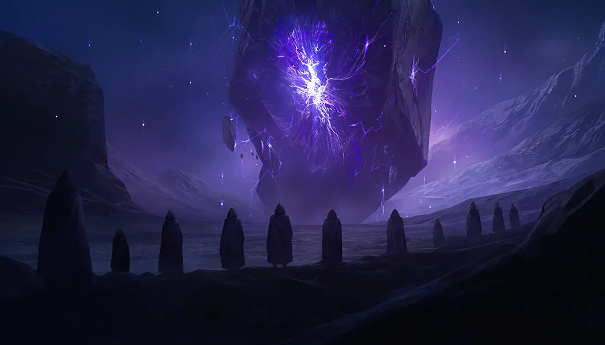

# ✨ Animations Site — Motion‑First React + Vite

<p align="center">
  
</p>

<p align="center">
  
  
  
  
  
  
</p>

A modern React app showcasing smooth, high‑fidelity animations with GSAP. Built on Vite, styled with Tailwind, and instrumented with Sentry for visibility.

---

## 🚀 Quick Demo

<p align="center">
  
  
  
</p>

> Tip: Add a short screen capture GIF of the hero animations for an eye‑catching preview.

---

## 📦 Tech Stack

- **Framework**: React 19, React DOM
- **Animations**: GSAP 3, **@gsap/react**
- **Build Tool**: Vite 7
- **Styling**: Tailwind CSS 3, PostCSS, Autoprefixer
- **DX & Quality**: ESLint (React Hooks, React Refresh), `react-icons`, `react-use`
- **Observability**: Sentry (Vite plugin for sourcemaps, React profiler wrapper)

---

## 🗂️ Project Structure

```txt
.
├─ public/
│  ├─ img/           # Static images (logo, gallery, artwork)
│  ├─ videos/        # MP4 clips for sections and features
│  ├─ fonts/         # Custom webfonts
│  └─ audio/         # Audio assets
├─ src/
│  ├─ components/    # Hero, About, Features, Story, Contact, Navbar, etc.
│  ├─ App.jsx        # Root app (export wrapped with Sentry.withProfiler)
│  ├─ main.jsx       # React entry
│  └─ index.css      # Tailwind entry + global styles
├─ index.html        # Vite HTML template
├─ vite.config.js    # Vite + Sentry plugin (sourcemaps enabled)
├─ tailwind.config.js# Tailwind theme & tokens
├─ eslint.config.js  # Linting rules
└─ package.json      # Scripts & deps
```

---

## 🧰 Getting Started

1. **Prerequisites**
   - Node.js >= 18
   - npm >= 9
2. **Install**
   ```bash
   npm install
   ```
3. **Run Dev Server**
   ```bash
   npm run dev
   ```
   Open the local URL that Vite prints (often http://localhost:5173).

---

## 📜 Scripts

- `npm run dev` — Start dev server with HMR
- `npm run build` — Production build to `dist/`
- `npm run preview` — Preview production build locally
- `npm run lint` — Lint codebase

---

## 🛡️ Sentry Setup (optional but recommended)

Sourcemaps are enabled in `vite.config.js` and the Sentry Vite plugin is configured with org/project.

- To upload sourcemaps during CI/CD builds, set an auth token and build:
  ```powershell
  $env:SENTRY_AUTH_TOKEN = "<your_token_with_project:releases>"
  npm run build
  ```
- You can also provide `SENTRY_ORG` and `SENTRY_PROJECT` as env vars if you prefer not to hardcode them.
- The app export uses `Sentry.withProfiler(App)` for performance tracing. Add DSN/init if you want runtime error reporting.

---

## 🧭 Development Workflow

1. **Branching**
   - Create feature branches from `main`: `feat/your-feature`, `fix/bug-name`, `chore/task`
2. **Develop**
   - Run `npm run dev`; keep changes small and focused
   - Prefer functional components, React hooks, and GSAP timelines for motion
3. **Quality Gate**
   - Run `npm run lint` and fix warnings/errors
4. **Commit**
   - Use clear messages, e.g. `feat(hero): add staggered title animation`
5. **Pull Request**
   - Open a PR with a brief description and screen capture
6. **Review & Merge**
   - Address feedback; squash or rebase to keep history clean
7. **Release**
   - `npm run build`; ensure Sentry sourcemaps upload if configured

> Pro tip: Keep animation code isolated in small components/hooks so it’s testable and easy to tweak.

---

## 🎨 Styling & Theming

- Tailwind CSS utilities for layout/spacing/typography
- Custom fonts and colors configured in `tailwind.config.js`
- Prefer semantic component classes and minimal custom CSS

---

## 🧩 Components

- **Hero**: headline animations and intro video
- **Features**: motion‑enhanced cards/sections
- **Story**: narrative with subtle transitions
- **Contact**: form/CTA
- **Navbar/Footer**: site chrome with smooth interactions

---

## 🛠️ Troubleshooting

- Dev server not starting? Ensure Node ≥ 18 and reinstall deps (`rm -rf node_modules && npm i` on Unix, or delete folder on Windows).
- Sourcemaps missing in Sentry? Confirm `SENTRY_AUTH_TOKEN` is set in the build environment and builds run in CI.
- Animations janky? Check for heavy reflows; use GSAP timelines and `will-change` where appropriate.

---

## 🤝 Contributing

- Fork the repo and create a feature branch
- Keep PRs focused and include screenshots for UI changes
- Ensure lint passes and add comments where logic is non‑trivial

---

## 📄 License

Add your license text or a link here (e.g., MIT). If unspecified, the code is considered proprietary by default.

---

If you’d like, I can add a short CI example (GitHub Actions) and a demo GIF to make this README even more stunning.